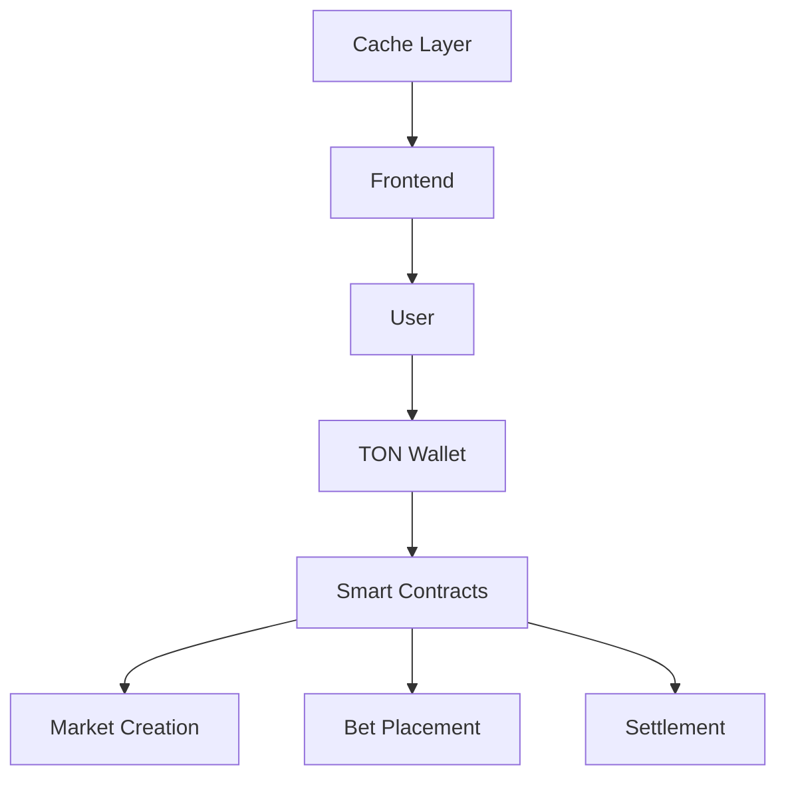

# ⚡ Spark
> A Decentralized Prediction Market Platform on TON Blockchain

[](https://opensource.org/licenses/MIT)
[](https://ton.org)

## 🎯 Overview
Spark is a decentralized prediction market platform built on The Open Network (TON), enabling users to create markets, place bets, and earn rewards based on real-world event outcomes.

## ✨ Key Features

### Market Creation & Trading
- 📊 Create prediction markets for any future event
- 💰 Place bets using TON tokens
- 🎉 Claim winnings automatically through smart contracts
- 📈 Real-time market analytics and trends

### Technical Features
- ⚡ Fast loading with data caching
- 🔒 Secure smart contract architecture
- 🌐 Decentralized oracle integration
- 📱 Mobile-responsive design

## 🚀 Getting Started

### Prerequisites
- TON Wallet
- Node.js v16+
- yarn/npm

### Installation
```bash
# Clone the repository
git clone https://github.com/tadashijei/spark

# Install dependencies
cd spark
yarn install

# Configure environment
cp .env.example .env

# Start development server
yarn dev
```

## 📱 Usage

1. Connect your TON wallet
2. Browse available prediction markets
3. Place bets on outcomes
4. Monitor your positions
5. Claim winnings after event resolution

## 🔮 Roadmap

### Q2 2024
- [ ] Enhanced UI/UX design
- [ ] Telegram theme support
- [ ] NFT badges for active users

### Q3 2024
- [ ] Mobile app release
- [ ] Advanced analytics dashboard
- [ ] Multi-language support

### Q4 2024
- [ ] Cross-chain integration
- [ ] DAO governance implementation
- [ ] Professional API access

## 🛠 Technical Architecture


## 👥 Contributing
We welcome contributions! Please see our [Contributing Guide](CONTRIBUTING.md) for details.

## 📄 License
This project is licensed under the MIT License - see the [LICENSE](LICENSE) file for details.

## 📞 Support
- Documentation: [docs.spark.ton](https://docs.spark.ton)
- Email: support@spark.ton
- Telegram: [@sparkmarkets](https://t.me/sparkmarkets)

---
<p align="center">Built with ⚡ on TON</p>
